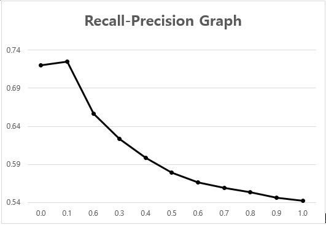

# Information Retrieval Term Project
### Korea Univ. Course COSE472

## 기간
    * 2016.09 ~ 2016.12

## 구현환경
    * Windows 10
    * Visual Studio 2015
    * C++ (Using STL, No extra library) 
    * Release x64

## 구현내용
    * Document Parsing
    * Stemming ( Using Porter2 Stemmer + 일부 개선)
    * Stopword Removing (불용어 제거)
    * Indexing (역색인)
    * Ranking ( Vector Space Model & Language Model & Dirichelet Smoothing )
    * Evaluation ( 평가 )

## Recall-Precision Graph

## 실행방법
    * index 파일들은 이미 생성되어 있고, 아래의 링크에서 다운받아야합니다.
    * index 파일들의 압축을 풀고, Execution files/실행파일.exe와 같은 위치에 두고, exe 파일을 실행합니다.
    * 실행 결과 result.txt 결과 파일이 생성되고, 이 파일을
      Execution files/evaluator.exe를 실행하면 평가파일 evaluation.txt가 출력됩니다.
    * 모두 같은 폴더에 있어야 정상적으로 작동합니다.

## 필요한 파일
    * Porter2 Stemmer - https://bitbucket.org/smassung/porter2_stemmer/src/f2a9c7fff1263e7c688fbef681fb01fe01059573?at=master
    * corpus (기사 약 55만개) - https://drive.google.com/file/d/0B8VS6fJASyTvLXc0S2t0X2VWYm8/view?usp=sharing
    * 역색인 파일 - https://drive.google.com/file/d/0B8VS6fJASyTvVkItNUVvZ0RENGc/view?usp=sharing
    * 최종 보고서 - https://drive.google.com/file/d/0B8VS6fJASyTvR1cxZTExa2c1N2M/view?usp=sharing